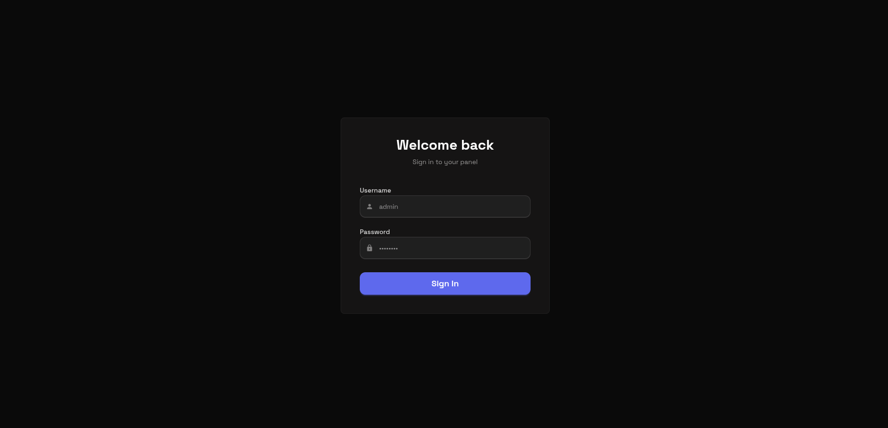
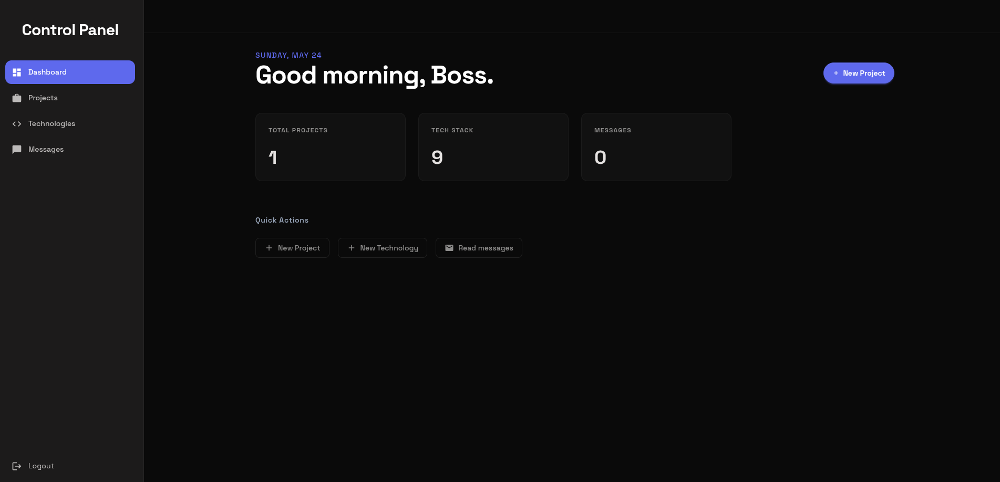
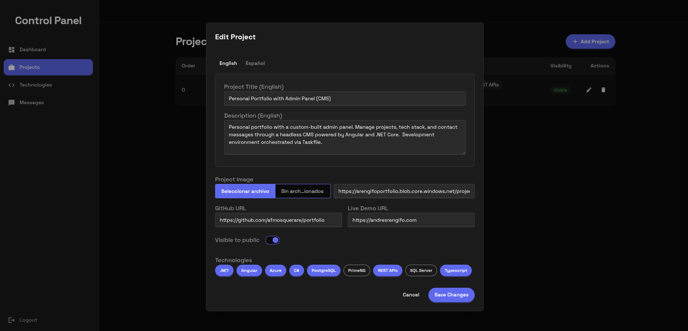
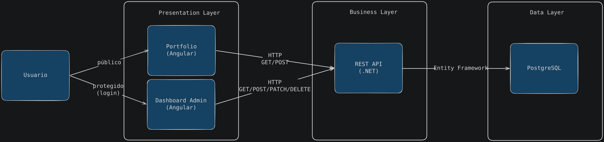

# Portfolio


A full-stack monorepo for a personal portfolio website and its administrative dashboard.

## Live Links

- **Portfolio**: [https://www.andresrengifo.com](https://www.andresrengifo.com)
- **Control Panel**: [https://dash.andresrengifo.com](https://dash.andresrengifo.com)

## Features

### Portfolio (Angular)
- UI animations via GSAP and Tailwind CSS.
- Dynamic data fetching from the API.
- Contact form linked to database storage.
- Dark mode theme using DaisyUI.


### Portfolio - Control Panel (Angular)
- JWT-based authentication for protected routes.
- CRUD operations for projects and technologies.
- Inbox view for contact messages.
- File upload handling for project media.
- State management via Angular Signals.







### Backend API (.NET 8)
- Endpoints for Projects, Technologies, Messages, Auth, and Storage.
- Data access using Entity Framework Core.
- DTO mapping via Mapster.
- Request validation using FluentValidation.

## Tech Stack

**Frontend (Web & Dash):**
- Angular 21 (Signals, Standalone Components)
- Tailwind CSS
- DaisyUI
- Iconify

**Backend:**
- .NET 8 / C# REST API
- PostgreSQL
- Entity Framework Core
- Mapster
- FluentValidation

**DevOps & Tools:**
- Docker & Docker Compose
- Taskfile

## Folder Structure

```text
/
├── api/                  # .NET Backend API source code
│   ├── src/              # Core API logic, controllers, and models
│   └── Portfolio.sln     # Visual Studio Solution
├── apps/                 # Frontend applications workspace
│   ├── dash/             # Angular administrative dashboard application
│   └── web/              # Angular public portfolio application
├── .config/              # Local development configurations
├── .vscode/              # Editor workspace settings
├── docker-compose.yaml   # Container orchestration for infrastructure
├── Taskfile.yml          # Task runner configuration for local development
└── .env.template         # Environment variables template
```

## Getting Started

### Prerequisites

Ensure you have the following installed on your system:
- .NET SDK (v8.0+)
- Node.js (v20+)
- Angular CLI
- Docker & Docker Compose
- Taskfile (Task runner)

### Local Development Setup

1. **Clone and Configure:**
   Clone the repository and duplicate the environment template:
   ```bash
   cp .env.template .env
   ```
   Fill in your specific local environment variables in the newly created `.env` file.

2. **Install Dependencies:**
   Install all necessary packages for the .NET API and both Angular frontends in one go:
   ```bash
   task install
   ```

3. **Run the Ecosystem:**
   Return to the root directory and start all services concurrently using Taskfile:
   ```bash
   task dev
   ```
   The `.NET API`, the `Web Frontend`, and the `Dash Frontend` will launch automatically.

*(Optional) Without Taskfile:*
If you don't have Taskfile installed, you must install dependencies and run the services manually across three separate terminal windows:
```bash

# Terminal 1 (API)
dotnet restore ./api/src/Portfolio.Api
dotnet run --project ./api/src/Portfolio.Api

# Terminal 2 (Web)
cd apps/web && npm install && npm start

# Terminal 3 (Dash)
cd apps/dash && npm install && npm start
```

## Architecture



